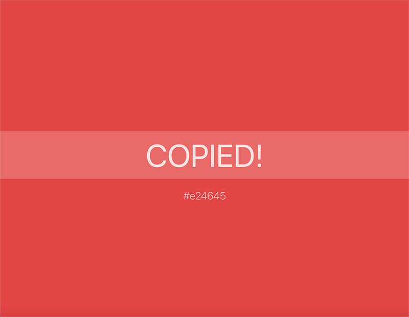

# 🎨 ChomaPal
### A React colors palettes app

CromaPal is a simple React app to create personalized colors palettes with the functionality to copy the color code (hex, rgb or rgba) by just clicking on it. It also generate automatically different shades for every color in the palettes.

ChromaPal is made using **JavaScript, React, JSS and Material UI**.

##### You can see the app in action here --> https://chromapal.netlify.app/

### Screenshots
    
    